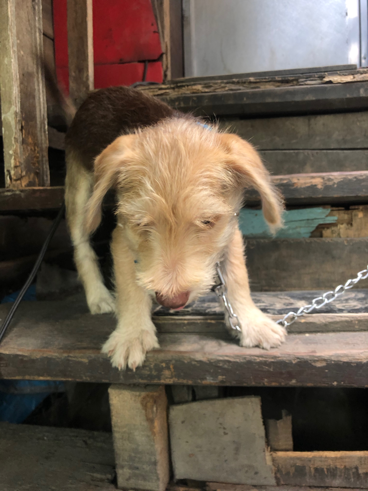

It's week 5! That's the number of fingers I have in one hand!

As the weeks keep counting, so does our learning! I dont know how but every week that's passed, for some reason, I get to learn new things every day. I'm not even fabricating any of these stories. Every week, I get mentored to new things (consciously or unconsciously) and I personally also get time to learn stuff on my own, at my own pace.

Scratch the 'for some reason` part, I do know the reason! It's the great culture of growth within the company and the people together with it. Every day I'm thankful, and everyday I'll keep doing my best to stay there.

Highlight of the week? I started learning Gatsby! I can't contain my excitement to start building my blog site for you guys! I'm currently learning it through @frontendmasters so if you want to learn it too, then I'm telling you the guys there got you. They have great teaching abilities and every moment I spent there, was a moment spent growing, more.

I got to learn the gist of gatsby, the best practice regarding configs, file structure, and basic patterns. I also got to learn and love MDX! (I'm in love with it!)

But that's only for my 'personal' learning sesh. From work, I got to learn so much CLI things from shortcuts, permissions, logging, and other (as some would call it) basic CLI things. I also get to learn a lot more dev ops related things like SSH, git, and more of docker-compose.

Also, the company got new mac computers and our boss literally said, 'merry christmas!' in the most genuine fatherly way possible and it really made me appreciate the company more. Such authenticity and good willing is so scarce, it must be protected!

That is also why I got to learn a lot of CLI things and dev ops related stuff because I had to setup the project on the new computers and mannnn I tell you, setting up a project composed of so many micro services is sooo hard. I mean we have containerized all of them but a computer can only have so much memory and CPU speed, I had to set up everything from scratch! From scratch!

But a challenge is a challenge! And is a path we must take for growth! I have yet to finish the set up so wish me luck in the following week!

But here is the collective list of what I've learned this week:

- CLI things
- more docker-compose learning
- SSH
- git powers!
- MDX
- Gatsby
- collaboration and empathy!

But as all good things may have happened this week, as we all know, the bad balances it out.  And if you have bad triggers regarding death, then you may skip this last part. Just know that I'll be processing it properly and that I hope you all the great things in the world.

But to share the bad part of this week,

My dog has passed away. I've never truly felt the emotion brought by death even by relatives before, but somehow this slapped like something else. This is my first time experience with death, or the death of someone really close or I had a relationship with.

You know, Bailey (my dog) was there when I left to work and arrived from it. He was there when I was sad and when I was feeling down.

Bailey was always there. Until he isn't anymore. And I'm really sad. I don't even know if what I'm feeling is sad, but I'm uneasy and I miss him.

Sorry for bringing this up to the point that it's probably way too personal, but just know that I'll do my best to be better soon. For Bailey.

Hoping you have a great week ahead.

Thanks for sticking by! Say a prayer for Bailey, for me.

Thanks and See you!
