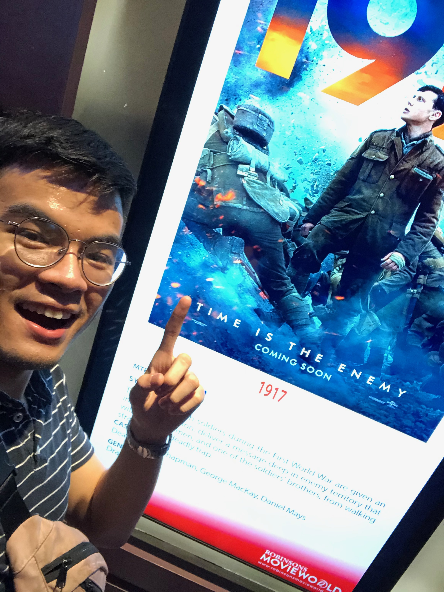

Today I saw the film 1917 directed by Sam Mendes at my local cinema's VIP seats (with the best sound, and better screen color rendering)

And I'm telling you, it was worth every penny, and I would pay to see it again, given that the joy of seeing it the first time would be there.

The cinematography. Damn. Where do I begin? It encapsulates the journey, it enthrals you to be with the lead actors, and it brings the story together -- with us along it. The camera work and editing is not just some behind the scenes magic, it is the magic. It humanizes the barrier between screen and person, and what's left is this captivating piece of art that makes you feel all the emotions embedded within it unfolding piece by piece in real time, or at least on how we perceive it.

Emotions. God, the emotions. The adrenaline, the heart attacks, the edge-of-the-seat feelings, and the gut wrenching atmosphere of war. I probably have not seen any movie that solidifies what all those feelings are in the context of war (even if I, myself, haven't been to war, this movie is the most realistic among everything else)

The silence, the noise, and the sound in between. Everything just is.

And this brings us to the score. The visuals are great, but they come alive with how fitting each score is played out on both monumental scenes and plain story walkthrough scenes. And everything just comes alive. It really does.

The story, however, could have been a little more, uhmmm, more? The story is great, don't get me wrong (especially with the deliverance of the cinematography) but when the movie ends, you end up wanting for more. You end up asking, is that it? Even if you knew from the beginning that, that was just supposed to be it.

But it could've been more. From a spectator perspective, this may sound greedy but the story could've been more bulkier.

But hey! Not saying the story presented wasn't great, it was incredible. It's just this lingering feeling of it being something more.

tl;dr

All in all, 1917 is a top tier war film, easily. The cinematography, the emotions, the suspense, the build up, and the plot cycle? Massively recommended. Without a doubt an incredibly genius piece of art.

If you're a massive cinema geek like me, 1917 is something you would fantastically enjoy in an instant. Can't you tell from my enthusiasm?

Okay, that's it.

A non professional movie critique but an avid fan of the art of cinema,
see you on the next one!
