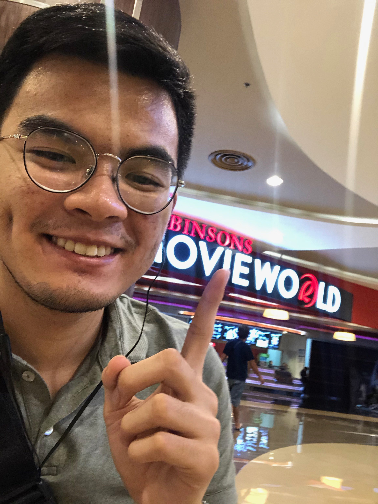

Today I watched **Little Women** written and directed by Greta Gerwig at my local cinema's VIP seats with this _huge_ screen that envelops your vision, and surreal sound systems that makes you feel like you're in the room with the scenes acted out on screen. (Like how I experienced 1917 [[review here]](/reviews/1917), which you should watch by the way, two weeks ago.)

As an avid fan of cinema, I seriously urge everyone to watch movies in such settings because it brings the feelings of emotion and experience to a different _alienated_ level. I was so excited to watch it today, i took a selfie!

Can you tell how excited I was? Haha anyway! It may cost more but it's supppper worth it! Just make sure to pay more for the right kinds of movies – as for me, that'd be marvel movies, good coming-of-age themes, and musicals.

Enough with the prelude! Let's talk about the movie!

First glance, people would easily assume it'd be another _"women empowerment"_ movie (which btw, there's definitely nothing wrong with that) and believe me, from the people I tried to encourage to watch the movie, these are their primary assumptions and it would take minutes to convince them that, yes, women empowerment is _one_ of the themes but there's soo much more to the story than that.

The story. I absolute appreciate the focus on the trivialities of everyday family life. The representation of the upper lower class and the showcase of their problems, the pains of growing up and the innate responsibility of lifting the family out of poverty, and the tolls our dreams and personal life takes against all that.

It's a different feeling when you see yourself represented on screen. It hits different. Most movies represent the extremes of social statuses, but not Little Women. You see the trials and sacrifices a family, that isn't rich but only capable, makes collectively and as individuals to make it through life with the most that they can.

You'll feel and understand certain characters, why they do what they do in terms of actions, and their choices in their relationships.

Maybe in all, maybe in one, or maybe in between, to certain perspectives you eventually see yourself within the characters.

And that brings us to the cinematography. God, the cinematography. The part where Joe and Beth were on the beach alone having a talk about what had happened and what should happen in the future? If it weren't for the cinematography, I wouldn't have felt the conclusion and hope in that scene as immensely as I just did. Thinking about that still makes me weak.

Also the part where all of them, were in the living room, and Frederick decided to play the piano? Literal _tears_. Not grief. Just the sheer joy of the company of family. The right ones. People who you know you have gone through shit with. And it builds up to this feeling of gratitude and hope which just breaks you.

And **_I love it_**

The casting? I can't even explain the greatness that is Saoirse Ronan. She just exudes emotion may it be rage, grief, or passion. The little details she does when she stutters, pauses, and crumbles makes it all so realistic and relatable. Meryl Streep? Emma Watson? Timothee Chalamet? God. Need I say more?

As a lover of coming-of-age movies and great stories, Little Women is a top tier movie. (and book!) Am I biased? Probably. But based from what I saw – the emotions, the cinematography, and the way it all comes together with everyone working on it – I'd put it on my recommended list.

It's story is not one-sided. It's complex, dare I say. How each character's story intertwines with the decision and the outcome of the other, above one story arc that is introduced at the beginning of the movie.

It's just **masterful writing.**

So, if you're looking for a story on family, growing up, sacrifices, beginnings, and choices unfolded through great cinematography then I suggest you buy a ticket for Little Women.

And you won't regret it!

As always, thanks for sticking by!

If you agree or disagree with this review, let me know on twitter [@carlojanea](https://twitter.com/carlojanea)

See you on the next one!
