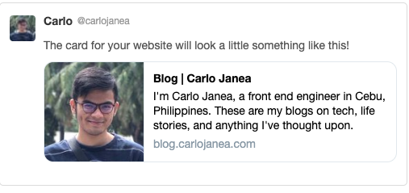

Today, I solved the biggest problem of all (yet, and atleast for me), making my blog SEO friendly. I, for one, have no clear idea what SEO specifically means but from what I understand, it's related to how you showcase your product, work, content, or what not to the public in the most attention-reaching way possible. May it be a card in social media, a google search data, or a customized content shared via chat, it all boils down to one thing:

> Making your site's metadata crawlable for information. Information used to create the above mentioned solutions.

Before we proceed, I made my blog with Gatsby, and managed my sites meta-data with react-helmet. This serves as context with the following 'guide' and code blocks below.

So where did I have a problem with my SEO journey, especially when I'm using react-helmet?

Well, it all starts with Gatsby. I wanted to make all pages SEO-friendly and shareable to social media with a custom card that showcases the basic content of the pages (different blogs, and the landing page).

So this requires a dynamic SEO component that receives different props for certain pages. _Easy_ right.

Turns out it should've been easy. But I overlooked one major thing. All the other props for react-helmet like description, title, author, and etc were pretty straight-forward.

What really stumped me for 2 days was the image preview. For 2 days I searched the web far and wide for solutions and every time I try one, it turns out to still not work.

Assume this was our SEO component

```javascript
import Helmet from "react-helmet"

// imageSrc is from childImageSharp > resize > src
// basically a relative path /someimage/someId/file.jpg
const SEO = ({ imageSrc, customPageProps }) => {
  const origin = typeof window !== "undefined"
      ? window.location.origin
      : ""

  const imagePath = `${origin}${imageSrc}`

  return (
    <Helmet ...someHelmetProps
        meta={[
            ...otherMetaProps,
            {
              property: 'og:image',
              content: imagePath
            },
            {
              name: 'twitter:image',
              content: imagePath
            }
        ]}/>
  )
}
```

Everything looks fine right? We get the origin e.g. `(https://website.com)` given that window exists so that we can concatenate our imageSrc depending on what environment we are (localhost, staging, or production)

I eventually uncovered that something is definitely wrong here! Thanks to Facebook's [sharing debugger](https://developers.facebook.com/tools/debug/?q=https%3A%2F%2Fblog.carlojanea.com%2F), I got to see one major thing I should've known from the beginning.

At first I thought everything was fine. There's an error where og:image is not a valid URL `/someimage/<someid>/file.jpg`. Oh there's no origin, must be normal and they're adding it behind the scenes?

Wrong! That assumption wasted me two days! It turns out there really isn't an origin! The fix would be

```javascript
import Helmet from "react-helmet"

// imageSrc is from childImageSharp > resize > src
// basically a relative path /someimage/someId/file.jpg
// ENV.ORIGIN_URL is an environment url set to the environment's origin URL

const origin =
  typeof window !== "undefined" ? window.location.origin : ENV.ORIGIN_URL

// or simply

const origin = ENV.ORIGIN_URL
```

But why? Shouldn't window exist? We'll yes and no. Yes, we need window to exist when viewing our site, but no when it is being crawled. Turns out when sites like Facebook or Twitter crawls your site, window is not needed!

So in our previous implementation, it would result to just the relative path. (which facebook told us to fix and my hard headed ass didn't listen)

Lesson learned? Listen to my errors! Also, debug first with [Facebook's debugger](https://developers.facebook.com/tools/debug/?q=https%3A%2F%2Fblog.carlojanea.com%2F) because I've spent way too much time on [Twitter's card validator](https://cards-dev.twitter.com/validator) and their logs are not very helpful.

Alright. After that, our card's now look professional! From no photo, to this face plastered over the internet!



Hope that helped you, too!

Don't make the same mistakes as me and listen to your errors!

Haha, see you on the next one!
